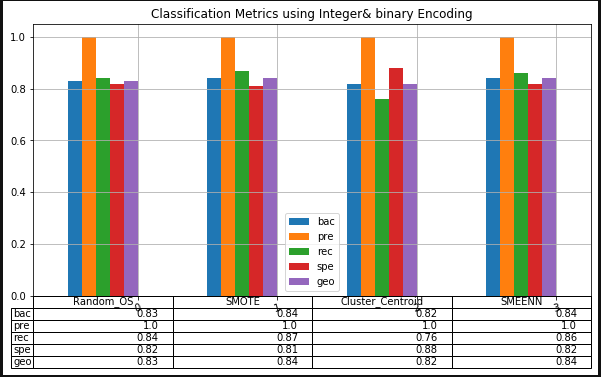
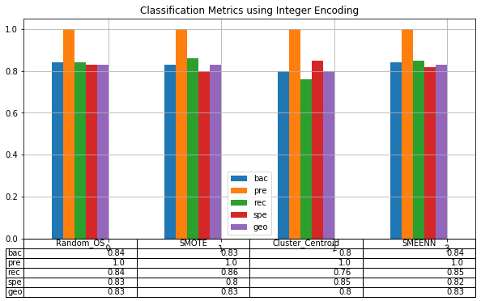
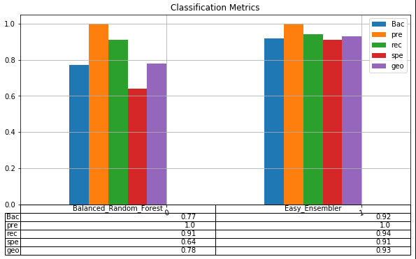
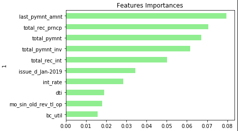

# Resampling_and_Ensembler_modeling
Evaluate several machine-learning models to predict credit risk using free data from LendingClub.

## Background

Auto loans, mortgages, student loans, debt consolidation ... these are just a few examples of credit and loans that people are seeking from Peer-to-peer lending services such as LendingClub. However, investors always want to mitigate risk and we can help them by using machine learning techniques to predict credit risk.

First will build and evaluate several machine-learning models to predict credit risk using free data from LendingClub. Credit risk is an inherently imbalanced classification problem (the number of good loans is much larger than the number of at-risk loans), so we need to employ different techniques for training and evaluating models with imbalanced classes using the two following techniques:

1. [Resampling](#Resampling)
2. [Ensemble Learning](#Ensemble-Learning)

---

### Encoding

In the notebook (credit_risk_resampling.ipynb) We will use both Integer enconding using label encoder and binary encoding using get_dummies. 

When to use which encoding technique: 

1. if we have data set that has nominal data such as Nouns(city, bank, state etc.) or nominal data such as zip code, longitude/lattitude or any data with multiple digits (exclusing $ amounts/price etc.,) it is better to binary encode using get dummies. 

2. In our data set we have month names(Jan, feb, Mar) in issue_d column and april, May in next paymnt date column, which can be considered as ordinal data. however the collection (of ordinal categories) is limited to 3 or 4, so we could just do integer encoding using label encoder and convert them to single digit representation. 

Another notebook (resampling_integer_encoded.ipynb) is created to demonstrate using integer encoding alone and evaluate the results between these two approaches of encoding. 

### Saving Encoded Data

After encoding, the encoded was saved for use in credit_risk_ensemble.ipynb so we dont have to redo the data cleansing and encoding again. 
[Lending Club Loans Encoded Data](Resources/credit_risk_encoded.zip)

### Resampling

We will use the [imbalanced learn](https://imbalanced-learn.readthedocs.io) library to resample the LendingClub data and build and evaluate logistic regression classifiers using the resampled data. Following resampling techniques are used:

Oversampling:
1. `Naive Random Oversampler` 
2. `SMOTE` algorithms.

Undersampling:
3. `Cluster Centroids` algorithm.
4. Over- and under-sample using a combination `SMOTEENN` algorithm.

For each of the above, we will :

1. Train a `logistic regression classifier` from `sklearn.linear_model` using the resampled data.
2. Calculate the `balanced accuracy score` from `sklearn.metrics`.
3. Calculate the `confusion matrix` from `sklearn.metrics`.
4. Print the `imbalanced classification report` from `imblearn.metrics`.

Using the metrics we will answer the following questions:

1. Which model has best balanced accuracy score
* BAC scores is more or less the same across the models, with mrginal difference. BAC scores from SMOTEENN and SMOTE models are equal at 0.838, cluster centroid model gave a BAC score of 0.821 and RandomOverSampling has  BAC score of 0.832. 
* Best BAC score is from SMOTE and SMOTEEN models. 

2. Which model had the best recall score?
* SMOTE model produced best Recall at 0.87. 
* SMOTEENN score is tad bit lower at 0.86. Cluster centroid produced lowest Recall at 0.76

3. Which model had the best geometric mean score?
* Both SMOTE and SMOTEENN models have same geo metric mean of 0.84.
* Cluster centroid model has the lowest geo mean of 0.82

4. Did the encoding technique used in this notebook had any impact on the results compared to previous notebook?
* Integer Encoding technique alone that is used in this notebook had very little impact (some metrics are down by 0.01) on the overall results.
* However, the resampling model selection had changed when using Integer encoding alone as against both Integeer and binary Encoding. just for the fact that there's difference of 1% to 1.5% in the classification metrics.  

## Conclusion:
SMOTE and SMOTEENN sampling models are better for our Credit Risk modeling compared to Random OVersampling  or Cluster centroid. 

### Result

<table> <tr> <td>

</td>
<td>

</tr>
</table>

### Ensemble Learning

In credit_risk_ensemble.ipynb notebook, we will train and compare two different ensemble classifiers to predict loan risk and evaluate each model. We will use the [Balanced Random Forest Classifier](https://imbalanced-learn.readthedocs.io/en/stable/generated/imblearn.ensemble.BalancedRandomForestClassifier.html#imblearn-ensemble-balancedrandomforestclassifier) and the [Easy Ensemble Classifier](https://imbalanced-learn.readthedocs.io/en/stable/generated/imblearn.ensemble.EasyEnsembleClassifier.html#imblearn-ensemble-easyensembleclassifier). 

For each model we will do the following steps :

1. Load the Lending Club data, split the data into training and testing sets, and scale the features data.
2. Train the model using the encoded data created from resampling notebook, saved in the `Resource` folder.
3. Calculate the balanced accuracy score from `sklearn.metrics`.
4. Print the confusion matrix from `sklearn.metrics`.
5. Generate a classification report using the `imbalanced_classification_report` from imbalanced learn.
6. For the balanced random forest classifier only, we will plot top 10 features importance sorted in descending order (most important feature to least important) along with the feature score.

using the metrics we will answer the following:

1. Which model has best balanced accuracy score
* Easy Ensembler Classifer produced best BAC score of 0.92

2. Which model had the best recall score?
* Easy Ensembler Classifer provided best recall score among the two

3. Which model had the best geometric mean score?
* Easy Ensembler Classifer provided best recall score among the two

4. What are the top three features?
* Last Payment Amount
* Total recovered Principal
* total payment

### Result

<table> <tr> <td>

</td>
<td>

</tr>
</table>

### Conculsion
for our Data set, Easy Ensmbler Classification model performs better on all metrics. 
---

